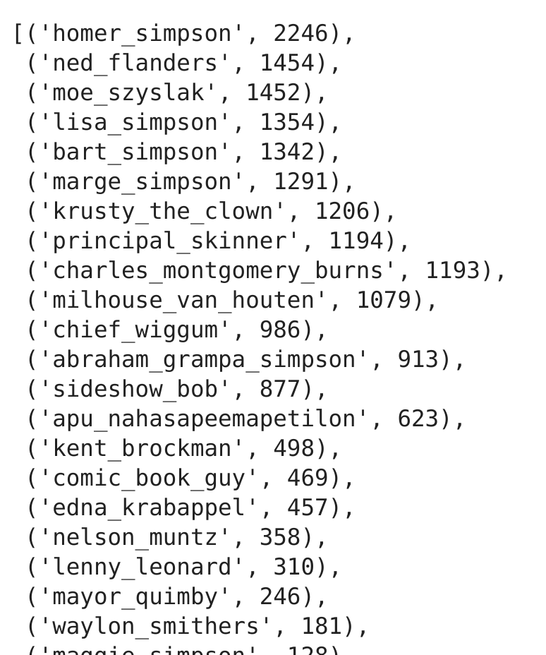
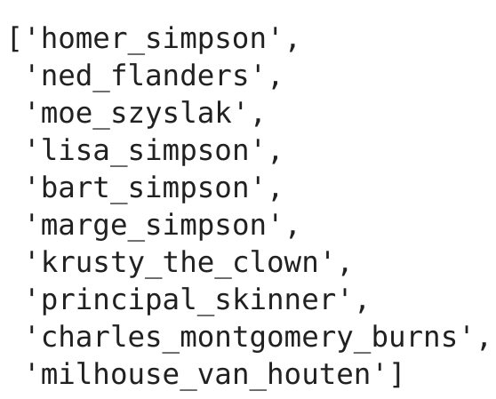

# 4-Deep-Computer-Vision
1. [Descargar data set ](#schema1)
2. [Instalar caer y canaro ](#schema2)
3. [Importar librerías ](#schema3)
4. [Redimensionar todas las imágenes y tener en una variable el dataset a usar](#schema4)
5. [Crear un diccionario con los personajes y ordenarlos de forma descendente](#schema5)
6. [Coger solor los 10 primeros personajes](#schema6)
7. [Crear los datos de entrenamiento](#schema7)
8. [Visualización de datos  ](#schema8)
9. [Separación de los array en featurSet y labels](#schema9)
10. [Normalizar el featureSet y convertir labels a clase binaria](#schema10)
11. [Division de los datos para en entrenamiento](#schema11)
12. [Image data generator ](#schema12)

# 1. Descargar data set

https://www.kaggle.com/alexattia/the-simpsons-characters-dataset

# 2. Insatalar caer y canaro

Instalar:
~~~
pip install caer canaro
~~~

# 3. Importar librerías

~~~python
import os
import caer
import canaro
import numpy as np
import cv2 as cv
import gc
import sklearn.model_selection as skm 
~~~

# 4. Redimensionar todas las imágenes y tener en una variable el dataset a usar.

~~~python
IMG_SIZE = (80,80)
channels = 1
char_path = '/home/patricia/Documentos/opencv/deep-computer-vision/data/simpsons_dataset'
~~~

# 5. Crear un diccionario con los personajes y ordenarlos de forma descendente
~~~python
char_dict = {}
for char in os.listdir(char_path):
    char_dict[char] = len(os.listdir(os.path.join(char_path,char)))

char_dict = caer.sort_dict(char_dict, descending=True)
~~~

# 6. Coger solor los 10 primeros personajes
~~~python
characters = []
count = 0
for i in char_dict:
    characters.append(i[0])
    count += 1
    if count >= 10:
        break
~~~

# 7. Crear los datos de entrenamiento
~~~python
train = caer.preprocess_from_dir(char_path, characters, channels=channels, IMG_SIZE=IMG_SIZE, isShuffle=True, verbose = 0)
~~~

# 8. Visualización de datos  
Lo hacemos con matplotlib porque opencv no se ve muy vien en jupyter notebook
~~~python
import matplotlib.pyplot as plt
plt.figure(figsize=(30,30))
plt.imshow(train[0][0], cmap='gray')
plt.show()
~~~

# 9. Separación de los array en featurSet y labels
~~~python
featureSet, labels = caer.sep_train(train, IMG_SIZE=IMG_SIZE)
~~~

# 10. Normalizar el featureSet y convertir labels a clase binaria
~~~python
from tensorflow.keras.utils import to_categorical

# Normalize the featureSet ==> (0,1)
featureSet = caer.normalize(featureSet)
# Converting numerical labels to binary class vectors
labels = to_categorical(labels, len(characters))
~~~

# 11. Division de los datos para en entrenamiento
~~~python
split_data = skm.train_test_split(featureSet, labels, test_size=.2)
x_train, x_val, y_train, y_val = (np.array(item) for item in split_data)
~~~

# 12. Image data generator 
(introduces randomness in network ==> better accuracy)
~~~python
datagen = canaro.generators.imageDataGenerator()
train_gen = datagen.flow(x_train, y_train, batch_size=BATCH_SIZE)
~~~